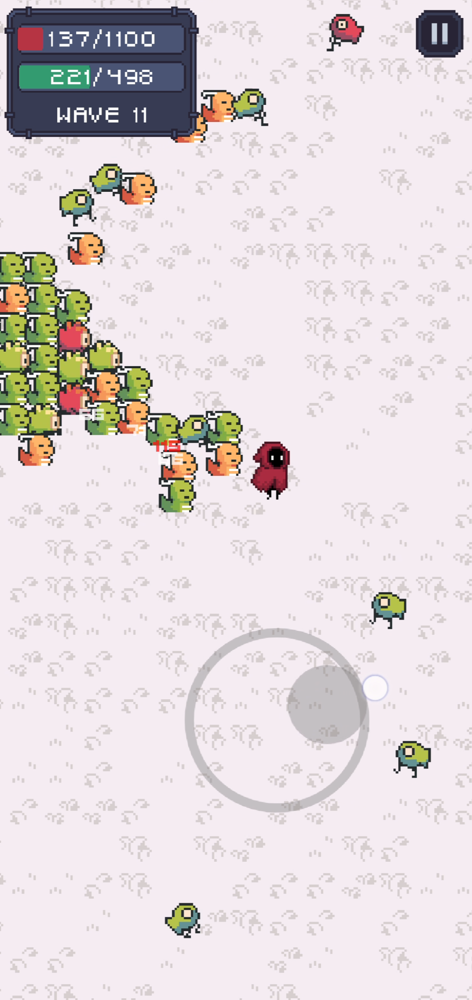
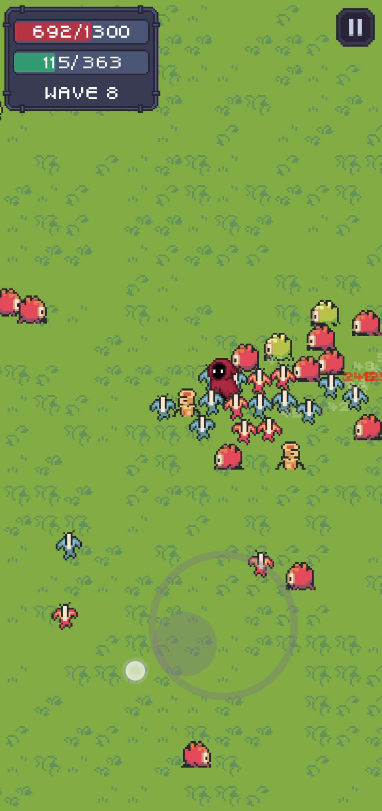

# Skip Wave

Skip Wave is a game with "roguelike" elements, with minimalist mechanics such as auto-shooting, in which waves of enemies rush towards you. 

It has 5 maps and 23 different enemies.

[Download at Google Play Store](https://play.google.com/store/apps/details?id=com.goldev.skipwave)

&nbsp;

## Credits

### Project technologies

- [Fleks](https://github.com/Quillraven/Fleks)
- [Ktx](https://libktx.github.io/)
- [Kotlin](https://kotlinlang.org/)

### Fonts

- [Clarity](https://gossamore.itch.io/clarity)
- [Thaleah](https://tinyworlds.itch.io/free-pixel-font-thaleah)

### Assets

- [Ninja Adventure](https://pixel-boy.itch.io/ninja-adventure-asset-pack)
- [Hooded Protagonist](https://penzilla.itch.io/hooded-protagonist)
- [FX062](https://nyknck.itch.io/fx062)

### Tools

- [Hiero (font bitmap packer)](https://libgdx.com/wiki/tools/hiero)
- [GDX Texture packer gui](https://github.com/crashinvaders/gdx-texture-packer-gui)
- [Tiled (map editor)](https://www.mapeditor.org/)
- [Tile Extruder](https://github.com/sporadic-labs/tile-extruder)
- [ImageMagick](https://imagemagick.org/)

### Teachers

Thanks to Silvia, Marisabel, David, Javi and Curro for being so passionate when teaching us, it inspired me to be a better professional

### Friends

I would like to thank my friends Manuel Marin and Gabriel Mottos for joining me in this adventure and help me when I need it

### Family

Thanks to my parents and my brother for their support. And of course to my girlfriend for being so patient and helping me with many of the ideas for the game.

### Simon

Thanks to my mentor Simon [(@quillraven)](https://www.youtube.com/@Quillraven). I am very grateful that you have shared your knowledge with others. It has made me improve and push my self to another level  

### And to myself

I'm very proud of me that I can make this project possible in just one month  